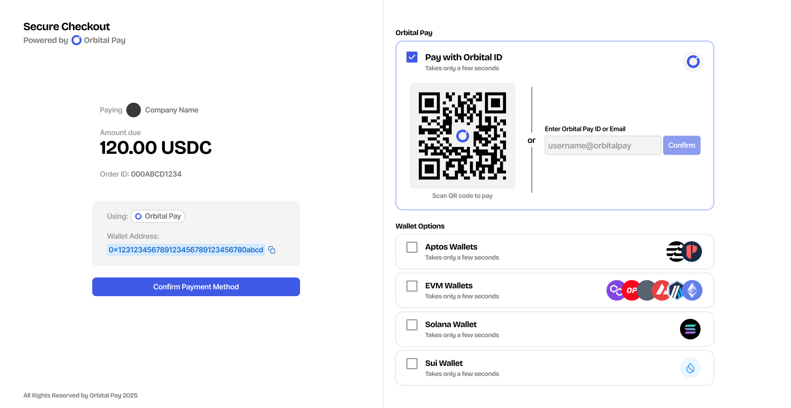

# Accept USDC

Many businesses prefer stablecoins over fiat as they are the fastest way of getting paid, and you can offramp locally (native cashout coming soon). Fiat suffers from locale issues, especially for cross border payments.

However, accepting stablecoins are a hassle when you have to manually give wallet addresses to send money too. The wallet is also limited to a particular chain, which your user might not use.

## Orbital Gateway

Orbital Gateway is our checkout interface for businesses who accept USDC payments. It's simple and familiar to other fiat-based tools.

<figure><figcaption>
Orbital Gateway's checkout interface
</figcaption></figure>

Orbital Gateway abstracts away these complexities of multiple wallets and chains into an account. Your user can pay through any wallet/chain they have USDC on, and you'll magically receive them in your Orbital Pay account.

Apart from paying others, you can as easily move the funds out to any chain you want. We maintain bi-directional bridges to the most popular chains both for payers and merchants alike.
